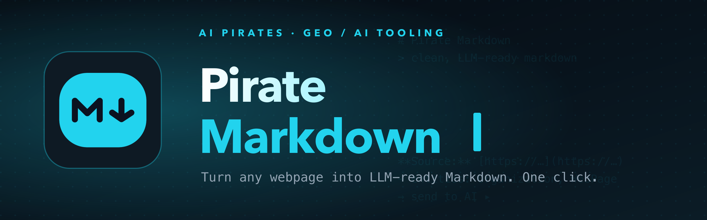
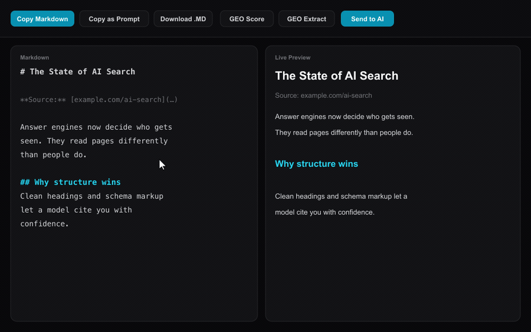

<div align="center">
  

  <h3>Turn any webpage into clean, LLM-ready Markdown. One click, no browser clutter.</h3>

  <p>
    
    
    
    
  </p>

  
</div>

---

Open a page, hit `Alt+M`, get clean Markdown. Send it straight to an AI, or pull out the entities that LLMs and search engines actually read. Made by [AI Pirates](https://ai-pirates.com).

## Features

- **One-click Markdown** via right-click or `Alt+M`. Nav, ads and clutter go, structure stays.
- **Preview tab** with live preview, editor, and toggles for images, links, metadata and heading map.
- **Export** to clipboard, as a `.md` file, or as a ready-to-paste AI prompt.
- **Send to AI** *(new)*: Markdown goes straight to Mistral or OpenAI, the response shows up in the tab. Your key stays local.
- **GEO Score** *(new)*: grades any page 0–100 on LLM/crawler readiness (structured data, meta, headings, content depth) with a prioritized fix list.
- **Generate Fix** *(new)*: one click turns the score gaps into copy-paste-ready `<meta>` + schema.org JSON-LD, written by your AI from the page content.
- **GEO / SEO extract** *(new)*: pulls title, meta, Open Graph, Twitter Card, schema.org entities and the heading structure into one structured block. Built for LLM visibility.

## How it works

1. Open any webpage
2. Right-click → "Pirate Markdown – Open Preview" (or press `Alt+M`)
3. Review the Markdown, send it to an AI, or grab the GEO extract

## Set up the AI connection

Open the options → "AI Connection" section:

| Field | Description |
| --- | --- |
| **Provider** | Mistral or OpenAI |
| **API Key** | stored locally in `chrome.storage.sync`, never sent to third parties |
| **Model** | e.g. `mistral-large-latest` or `gpt-4o` |
| **System Prompt** | the default task for the "Send to AI" button |

## Tech stack

Plasmo · React · Tailwind · [Defuddle](https://github.com/kepano/defuddle) (content extraction) · [Turndown](https://github.com/mixmark-io/turndown) (HTML → Markdown)

## Development

```bash
pnpm install
pnpm dev          # dev server, load build/chrome-mv3-dev as an unpacked extension
pnpm build        # production build (chrome-mv3-prod)
pnpm build:all    # Chrome + Firefox as ZIP
```

Load unpacked: `chrome://extensions` → Developer mode → "Load unpacked" → `build/chrome-mv3-dev`.

## License & credits

Pirate Markdown is licensed under **GPL-3.0-or-later** (see [LICENSE](LICENSE)). Fork it, ship it, but downstream distributions stay open under the same terms.

Built on top of [MD-This-Page](https://github.com/Ademking/MD-This-Page) by **Adem Kouki** — props for the original one-click extraction. His code stays under its original MIT license (see [NOTICE](NOTICE)).

What AI Pirates added: the cyan rebrand, **Send to AI** (direct Mistral/OpenAI from the preview), and the **GEO/SEO extract** (schema.org entities, Open Graph, heading map).

<div align="center">
  <br>
  <sub>Built by <a href="https://ai-pirates.com"><b>AI Pirates</b></a> · GEO / AI Tooling · <a href="mailto:hi@ai-pirates.com">hi@ai-pirates.com</a></sub>
</div>
